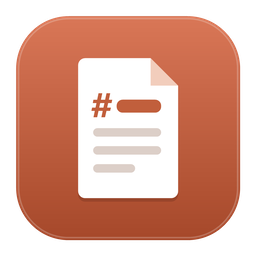
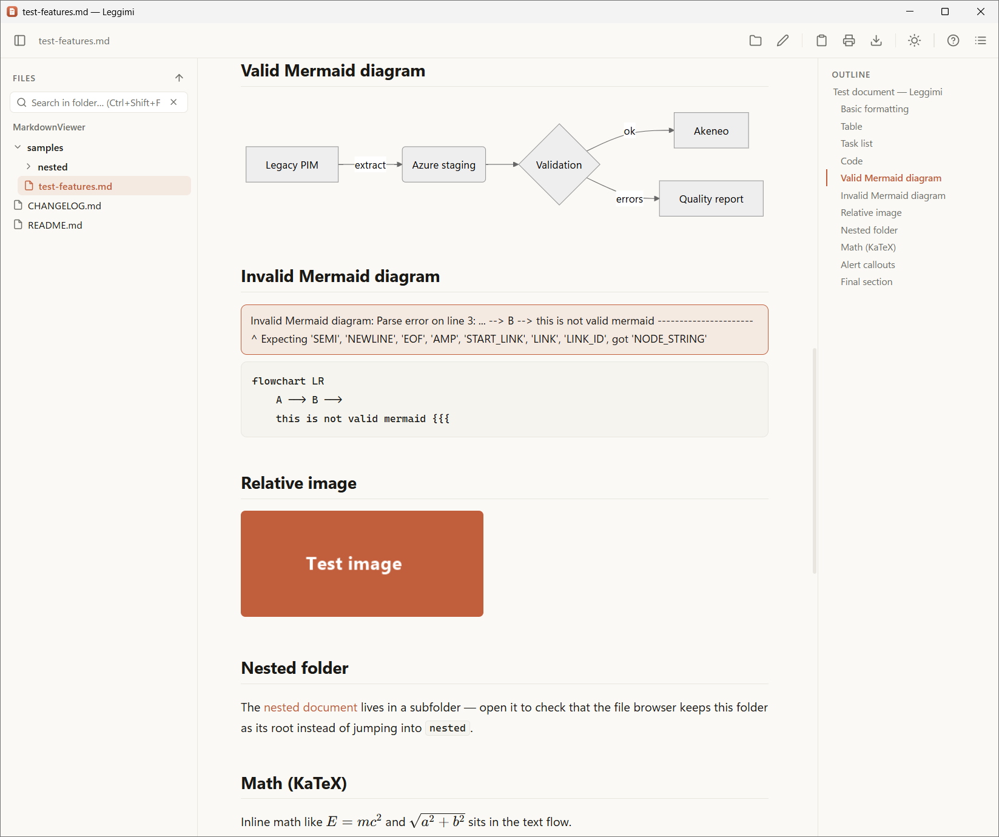
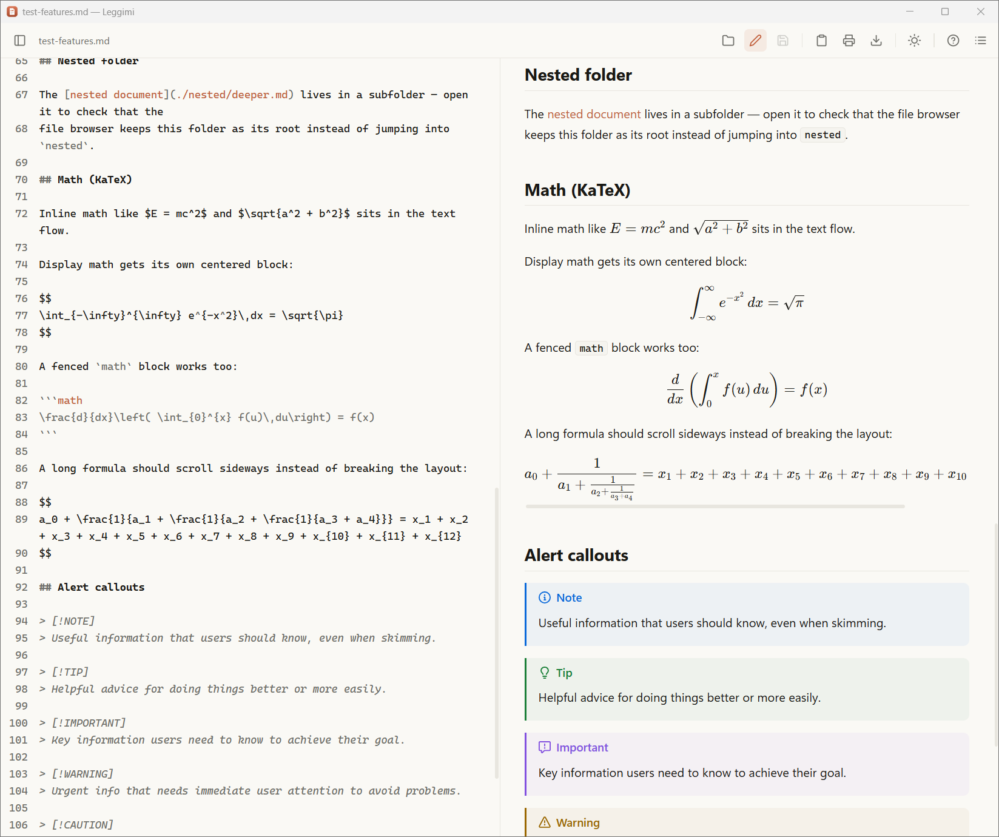

<p align="center">
  
</p>

# Leggimi

*Leggimi* — Italian for "read me" — is a fast Markdown viewer and editor for Windows, built with
Tauri 2. Documents open in a clean, centered reading column with light and dark themes; an
optional edit mode adds a split view with a live preview. Files are only modified when you save
explicitly.

<p align="center">
  
  
</p>

## Features

- Documents always open in **viewer mode**; `Ctrl+E` switches to **edit mode**: CodeMirror
  editor on the left, live preview on the right, updated as you type
- Explicit save with `Ctrl+S`, unsaved-changes indicator and confirmation guards; line endings
  (CRLF/LF) are preserved on save
- If a preview render fails mid-edit, the last good preview stays on screen and a dismissable
  notice appears — the pane never goes blank
- **Paste or drop images in edit mode**: they are saved to an `assets/` folder next to the
  document and linked with a relative path, Typora-style
- GitHub-flavored Markdown: tables, task lists, strikethrough, autolinks
- Syntax-highlighted code blocks with a copy button
- **Mermaid** diagrams, bundled locally so they work offline
- **KaTeX math**: `$…$` inline, `$$…$$` or ` ```math ` fences for display blocks
- **GitHub-style callouts**: `> [!NOTE]`, `[!TIP]`, `[!IMPORTANT]`, `[!WARNING]`, `[!CAUTION]`
- Clickable **outline** with scroll-spy
- **File browser** for the Markdown files in the folder you opened; collapsed folders are
  remembered across navigation and restarts
- **Search across the folder** (`Ctrl+Shift+F`): full-text and file-name matches with
  snippets; opening a result highlights the term in the document
- **Live reload** when the file changes on disk, preserving your reading position; with unsaved
  edits it warns instead of overwriting your buffer
- **Share menu** (`Ctrl+Shift+E`) collecting everything that leaves the app: **copy as rich
  text** (`Ctrl+Shift+C`) to paste with formatting into Outlook, Word or Teams; **print / save
  as PDF** (`Ctrl+P`) with a paper-oriented layout; **export to self-contained HTML or DOCX** —
  in Word, math becomes native equations and Mermaid diagrams become images
- **Reading settings** (the `Aa` button): text size (`Ctrl+=` / `Ctrl+−` / `Ctrl+0` /
  `Ctrl`+scroll), sans or serif font, line spacing, column width and the **light / dark /
  follow Windows** theme — all remembered across restarts, never affecting print or export;
  the editor text scales along with the size
- Find in document (`Ctrl+F`), relative images
- Opened files land in Windows' **Recent items and the taskbar jump list**
- Double-click any `.md` file in File Explorer — the installer registers the association
- Single instance: further files open in the existing window
- Drag and drop files onto the window, or press `Ctrl+O`
- Built-in help (`F1`) showing the running version

## Keyboard shortcuts

| Keys | Action |
|---|---|
| `Ctrl+O` | Open a file |
| `Ctrl+E` | Toggle edit mode |
| `Ctrl+S` | Save the file (edit mode) |
| `Ctrl+F` | Find in document |
| `Ctrl+Shift+F` | Search across the folder |
| `Enter` / `Shift+Enter` | Next / previous match |
| `Ctrl+B` | Toggle the file browser |
| `Ctrl+I` | Toggle the outline |
| `Ctrl+P` | Print or save as PDF |
| `Ctrl+Shift+C` | Copy the document as rich text |
| `Ctrl+Shift+E` | Open the Share menu |
| `Ctrl+=` / `Ctrl+−` | Larger / smaller text |
| `Ctrl+0` | Reset the text size |
| `F1` | Show help |
| `Esc` | Close the find bar or help |

## File browser

The left panel is rooted at the folder of the document you opened and lists Markdown files up to
four levels of subfolders (capped at 2000 files). Opening a file from the panel keeps the same
root, so navigating into a subfolder does not hide the rest of the tree; the up arrow moves the
root to the parent folder. Opening a document outside the current root re-roots the panel there.
Folders you collapse stay collapsed while you navigate and across restarts; the folders on the
path of a newly selected file auto-expand to reveal it. Folders with no Markdown files are
hidden, as are hidden folders and build directories such as `node_modules`, `target` and `dist`.

## Versioning and releases

`package.json` is the single source of truth for the app version: `tauri.conf.json` reads it
from there, so the window, the installer and the version shown in the app can never drift apart.
The running version appears in the help dialog (`F1`) and on the empty screen.

To cut a release:

```powershell
npm version patch      # a fix        (1.0.0 -> 1.0.1)
npm version minor      # new features (1.0.0 -> 1.1.0)
npm run tauri build    # installer carries the new version
```

Record what changed in [CHANGELOG.md](CHANGELOG.md). `npm version` also creates a git tag; push
it with `git push --follow-tags`. Keep `src-tauri/Cargo.toml` in step for tidiness — it is the
crate version and does not drive what the app displays.

## Development

Requirements: Node 20+, Rust stable, WebView2 (preinstalled on Windows 11).

```powershell
npm install
npm run tauri dev        # development
npm run tauri build      # produces the NSIS installer in src-tauri\target\release\bundle\nsis\
```

Note: in dev mode Vite does not apply the CSP configured in `tauri.conf.json` — test images and
Mermaid in a production build too.

## Project layout

- `src/` — TypeScript + Vite frontend (markdown-it, highlight.js, DOMPurify, mermaid,
  CodeMirror 6 for the editor)
- `src-tauri/` — Rust backend: file read/write and tree commands, debounced file watcher
  (notify), single instance, `.md` file association
- `samples/` — test documents; `test-features.md` exercises every feature

A `private/` folder, if you create one, is excluded from git: use it for personal documents you
want to open in the app without risking committing them.

## License

Leggimi is free and open source software released under the [MIT License](LICENSE).
