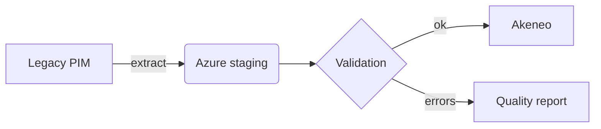

# Test document — Leggimi

This document exercises every feature of the viewer.

## Basic formatting

Text in **bold**, *italic*, ~~strikethrough~~, `inline code` and an [external link](https://www.anthropic.com). Quotes like "these" and dashes -- are converted by the typographer.

> A blockquote with an accent border.
> Spanning several lines, to check the rendering.

## Table

| System | Role | Notes |
|---|---|---|
| Legacy PIM | Current system | To be retired |
| Akeneo | Target PIM | Already used by the group |
| Azure Service Bus | Middleware | Group integration layer |

## Task list

- [x] Tauri scaffolding
- [x] Rust backend
- [ ] Installer QA
- [ ] Release

## Code

```typescript
export async function openFile(path: string): Promise<void> {
  const doc = await readMarkdown(path);
  render(doc);          // outline + mermaid + file tree
}
```

```python
def migrate(products: list[dict]) -> None:
    """Migrate the catalog."""
    for p in products:
        print(f"SKU {p['sku']}")
```

## Valid Mermaid diagram



## Invalid Mermaid diagram

```mermaid
flowchart LR
    A --> B -->
    this is not valid mermaid {{{
```

## Relative image


## Nested folder

The [nested document](./nested/deeper.md) lives in a subfolder — open it to check that the
file browser keeps this folder as its root instead of jumping into `nested`.

## Final section

Last section, to test the outline scroll-spy. Press `Ctrl+F` and search for "Akeneo" to try the find bar.
