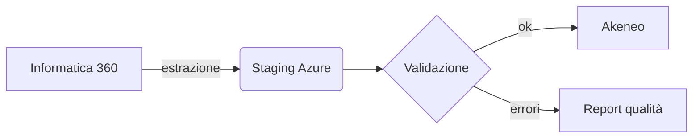

# Documento di test — Markdown Viewer

Questo documento esercita tutte le funzionalità del viewer.

## Formattazione di base

Testo **grassetto**, *corsivo*, ~~barrato~~, `codice inline` e una [link esterna](https://www.anthropic.com). Le virgolette "tipografiche" e i trattini -- vengono convertiti dal typographer.

> Una citazione con bordo accentato.
> Su più righe, per verificare la resa.

## Tabella

| Sistema | Ruolo | Note |
|---|---|---|
| Informatica 360 | PIM attuale | Da dismettere |
| Akeneo | PIM target | Già in uso per Chicco |
| Azure Service Bus | Middleware | Integrazione di gruppo |

## Task list

- [x] Scaffolding Tauri
- [x] Backend Rust
- [ ] QA installer
- [ ] Rilascio

## Codice

```typescript
export async function openFile(path: string): Promise<void> {
  const doc = await readMarkdown(path);
  render(doc);          // TOC + mermaid + tree
}
```

```python
def migrate(products: list[dict]) -> None:
    """Migrazione verso Akeneo."""
    for p in products:
        print(f"SKU {p['sku']}")
```

## Diagramma Mermaid valido



## Diagramma Mermaid non valido

```mermaid
flowchart LR
    A --> B -->
    questo non è mermaid valido {{{
```

## Immagine relativa


## Sezione finale

Ultima sezione per testare lo scroll-spy dell'indice. Premi `Ctrl+F` e cerca "Akeneo" per provare la ricerca.
